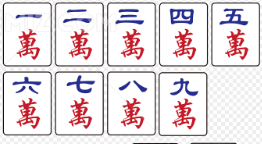
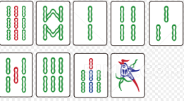
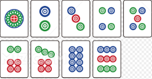
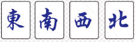
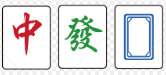
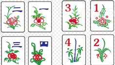

# 一、麻将基础内容及基本规则

麻将是发源于中国的古代四人博弈游戏。它由 100 张以上的小骨牌组成，通过**打牌**、**鸣牌**、**摸牌**来组成特定牌型以获得胜利。麻将的核心在于**博弈**——你需要根据他人的出牌来尝试反推其手牌，从而防止自己打牌输给他人。

麻将文化博大精深。由于发展时间很长，中国各地和东亚文化圈内流传着各种不同的麻将规则。本文仅收录部分最基础和常见的规则，并在后文做详细解释。

## 1. 牌面介绍

虽然各地规则不一，麻将牌型也各有差异，但几乎所有四人麻将均有以下 **108 张**、**27 种**、**3 色**基础牌：

一万 ~ 九万，统称**万子**；

一索 ~ 九索（或称一条 ~ 九条），统称**索子**（或称条子）；

一筒 ~ 九筒（或称一饼 ~ 九饼），统称**筒子**（或称饼子）。

以上牌每种有 4 张，共 27 * 4 = 108 张。这 108 张牌就是麻将牌的核心，所有麻将均包含它们。其中，“一筒”有时被称为“大饼”、“幺饼”、“幺筒”；“一索”被称为“幺鸡”、“幺索”、“幺条”；“一万”被称为“幺万”。

我们称以上的牌为**“数牌”**。

除此以外，常规麻将还包含额外的 28 张牌。因此常规麻将共包含 108 + 28 = 136 张牌。额外的 28 张牌包括：

东风、南风、西风、北风

红中、发财、白板

以上牌统称**“字牌”**。每种牌有 4 张，共 28 张。其中“东风”、“南风”、“西风”、“北风”统称**风牌**；“红中”、“发财”、“白板”统称**元牌**或**三元牌**。

部分地区的麻将还有“梅、兰、竹、菊”、“春、夏、秋、冬”等花牌：

由于花牌应用范围较小，因此 TNT 公式战不会采用这 8 张牌。

至此，你应该已经了解，136 张牌的麻将可以被分为 **34 种**、**5 色**（万子、筒子、条子、风牌、元牌）、**2 类**（数牌、字牌）。除此之外，还有以下两种类别称呼：
- **幺九牌**：指一万、九万、一筒、九筒、一索、九索这 6 种数牌，以及 7 种字牌。
- **中张牌**：除幺九牌外的所有数牌。

相较于扑克牌，麻将的牌面种类繁多。新手玩家需要反复熟悉和记忆，以免出现“上桌数点数”的尴尬情况。

## 2. 麻将游戏流程及目标

麻将一般为四人游戏，部分地区也有三人玩法。尽管各地规则不一，但所有麻将基本都遵循一个核心目标：**凑牌型**。

一局麻将的标准游戏流程如下：
1. **确定庄家**：规则不一，可以通过座位面东为庄、摇骰子为庄、抽签为庄等方式决定。
2. **摸牌**：从庄家开始摸牌，每人摸 13 张牌作为手牌。
3. **出牌循环**：从庄家开始出牌。任何人出牌前，需要在牌山中摸取一张牌加入手牌（或进行鸣牌），从而保证自己的牌在非出牌阶段的数量总是 13 张。
4. **出牌顺序**：一般为东风、南风、西风、北风，即逆时针顺序进行。
5. **和牌**：某人在摸牌时摸到了自己需要的牌，或是别人打出了自己需要的牌，该人即可和牌并获得胜利，本局游戏结束。
6. **下一轮**：按规则顺延庄家或重新选取庄家，进行下一局游戏。

麻将游戏的目标为：**将手牌凑成 4 * 3 + 2 的形式**。
这其中：
- `3` 指的是**顺子**、**刻子**或**杠子**，它们统称为**“面子”**。
- `4` 指的是你需要凑齐 4 副“面子”。
- `2` 指的是一对相同的牌，称为**“雀头”**（或将牌）。

由于 4 * 3 + 2 = 14 张牌，而手牌常驻只有 13 张，因此和牌总是在**摸起第 14 张牌**后，或是**某人打出你需要的那张牌**时发生。

麻将牌型的大小基本由面子决定，因此凑面子是麻将的核心。以下是面子的介绍：
- **顺子**：对数牌而言，同花色的数牌数字连续 3 张即算为顺子。例如：三万、四万、五万；七筒、八筒、九筒。
- **刻子**：对任意牌而言，连续 3 张相同的牌即算为刻子。例如：二索、二索、二索；东风、东风、东风。
- **杠子**：对任意牌而言，连续 4 张相同的牌即算为杠子。例如：幺鸡、幺鸡、幺鸡、幺鸡；发财、发财、发财、发财。但杠子必须“鸣牌”才可以算作杠子，否则只能算作一副刻子加上一张单牌。

当某次打出牌后，你的牌只差 1 张就能凑成 4 * 3 + 2 的牌型了，那么就称你**“听牌”**了。我们可以称你“听”了你想要的那张牌。听牌不一定只听一张，也可以听两张或更多。例如以下牌型：

一万 二万 二万 三万 三万 五筒 五筒 东风 东风 东风 / 碰[南风 南风 南风]

以上牌型，既可以等一张“一万”和牌，也可以等一张“四万”和牌。

大部分地区的麻将均无需喊出自己听牌。但部分麻将（如日本麻将）喊出“门前清听牌”（立直）可以算作一种番数奖励。立直后，玩家不能再更改自己的手牌，只能摸什么打什么。具体规则会在第二章介绍。

当一次摸牌后，手牌凑成了 4 * 3 + 2 的形式，或是某人打出一张牌，这张牌恰好可以和你的手牌凑成 4 * 3 + 2，那么你可以选择**和牌**，获得本场游戏的胜利。自己摸牌和牌称为**“自摸”**，其他人打牌你和牌称为**“放铳和”**、**“荣和”**或**“点炮”**等。

??? tips "为什么“选择”和牌而非立即和牌？"
    麻将是一个靠凑牌获胜的游戏，凑出的牌型越整齐，赢得的点数越多。有时候你的听牌不止一张，和牌 A 赢得的点数不如和牌 B 多。因此，当有人打出牌 B 时，你可以战略性地选择不和牌，等下一次牌 A 出现时再和牌。

## 3. 鸣牌介绍

在麻将过程中，如果只允许玩家一味地自己摸牌、打牌，那么麻将就完全成了一种运气游戏。因此，麻将允许玩家获取其他玩家打出的牌。这种行为称为**“鸣牌”**。

鸣牌共有三种，具体介绍如下：
- **吃**：上家打出一张牌，如果你的手里恰好有两张牌可以与该牌组成一个**顺子**，那么你可以进行“吃”。
- **碰**：任意一家打出一张牌，如果你的手里恰好有两张牌可以与该牌组成一个**刻子**，那么你可以进行“碰”。
- **杠**：分为明杠、暗杠和补杠三种。
  - **明杠**：任意一家打出一张牌，如果你的手里恰好有该牌组成的一个刻子（即 3 张相同的牌），那么你可以进行“明杠”。日常中一般简称为“杠”。
  - **暗杠**：如果你的手中有 4 张相同的牌，那么你可以进行“暗杠”。
  - **补杠**：如果你曾经碰过某种牌，而现在你又摸到了第 4 张该牌，那么你可以进行“补杠”。

鸣牌只能在其他玩家打出一张牌后立即进行（暗杠和补杠除外）。如果一人打出牌后无人鸣牌，那么其下家正常继续摸牌；如果有人鸣牌，则鸣牌者获得该牌，随后直接跳过中间的玩家，由鸣牌者打出一张牌，并从鸣牌者开始继续游戏。

鸣牌后，你需要将参与鸣牌的这组牌亮出在桌面上，作为一副完成的面子。例如：A 打出一张二索，B 手中有三张二索，则 B 可以进行“杠”（明杠）。B 需要亮出三张二索，并拿走刚刚打出的二索放在一起，之后从 B 开始游戏继续。由于每次鸣牌都会固定形成一副面子，而和牌只需要 4 副面子，所以玩家一局中最多可以进行 4 次鸣牌（不包含“补杠”）。

除杠牌以外，玩家鸣牌后需要立刻打出一张手牌。而在杠牌后，玩家需要先从岭上（部分地区规则是牌山的下一张，或者是牌山的最后一张）摸一张牌补充手牌，然后再打出一张牌。

??? note "一些鸣牌例子，供新手理解"
    - A 的下家是 B，B 手中有六筒、八筒。A 打出了一张七筒，B 选择“吃”。B 亮出六筒、八筒并获得七筒，随后 B 打出了一张东风。C 继续摸牌打牌。
    - A 的对家是 B，B 手中有六筒、八筒。A 打出了一张七筒，**B 不能选择“吃”**（只能吃上家的牌）。
    - A 的对家是 B，B 手中有两张红中。A 打出了一张红中，B 选择“碰”。B 亮出两张红中并获得红中，随后 B 打出了一张六筒。C 继续摸牌打牌。
    - A 的对家是 B，B 手中有两张五索。A 打出了一张五索。由于 B 手中还有一张四索和一张六索（原本可以凑成顺子），B 选择不拆开该顺子，因此 B 放弃“碰”。注意，B 全程不需要说任何话，C 作为 A 的下家照常摸牌打牌。
    - A 的上家是 B，B 手中有三张一万。A 打出了一张一万，B 选择“杠”。B 亮出三张一万并获得一万，然后 B 从岭上摸了一张牌，打出后，C 继续摸牌打牌。
    - A 的下家是 B，B 的下家是 C。B 的手中有二万、三万、五筒，C 的手中有六筒、七筒。A 打出了一张一万，B 选择“吃”，然后 B 打出了五筒；此时 C 并没有摸牌，而是对五筒继续选择“吃”，然后 C 打出一张牌，D 继续摸牌打牌。
    - A 的对家是 B。A 手中有两张二万，B 的手中有两张东风。A 打出了一张东风，B 选择“碰”，然后 B 打出了一张二万；A 看到二万也选择“碰”，然后 A 打出一张牌，C 作为 A 的下家继续摸牌打牌。
    - B 摸牌时发现手牌有四张南风，B 选择“暗杠”。亮出后（部分地区规则是不亮出），B 从岭上摸得一张牌，然后打出一张牌，C 继续摸牌打牌。
    - B 摸牌时发现手牌中有四张五索、一张六索和一张七索。由于这相当于一个刻子和一个顺子，B 放弃暗杠，继续打牌。过了几巡，B 为了防守打出了七索，导致顺子被拆。因此，B 可以在打出七索前进行“暗杠”，从岭上摸牌后再打出七索。
    - A 的对家是 B，B 手中有两张红中。A 打出了一张红中，B 选择“碰”。过了几巡，B 摸牌摸到了第 4 张红中。由于这张牌留在手中凑不出顺子，B 选择“补杠”。B 将红中加在已经亮出的三张红中上方，然后从岭上摸了一张牌，打出一张牌后游戏继续。

!!! warning
    注意：当别人打出某张牌你可以和牌时，即使这张牌你需要用来“吃”才能凑齐面子，只要能和牌，你都可以直接宣布和牌（不受只能吃上家牌的限制）。

至此，你应该已经学会了打麻将的基本逻辑！麻将无非就是摸来一张牌，再打出一张自己不需要的牌（或者为了防御而打出别人都不要的安全牌），最终想尽办法凑成 4 * 3 + 2 的牌型。

接下来，请尝试判断以下这种牌型（已听牌），它听的到底是哪张牌？

一万 一万 一万 二万 三万 四万 五万 六万 七万 八万 九万 九万 九万 / 无鸣牌

发财、发财、发财、发财。但杠子必须鸣牌才可以算杠子，否则算作一副刻子+单张牌。

当某次打出牌后，你的牌只剩某 1 张就能凑成 4\*3+2 的牌型了，那么就称你“听牌”了。可以称你“听”你需要的牌。听牌不一定只有一张，也可以有两张以上。例如以下牌型：

一万 二万 二万 三万 三万 五筒 五筒 东风 东风 东风 / 碰\[南风 南风 南风\]

以上牌既可以得到一张一万和，也可以得到一张四万和。

大部分地区麻将均无需喊出自己听牌。部分麻将喊门前请的听算一种番（如日麻）。部分麻将喊听后不能再更改自己的手牌，只能摸牌并打出这张牌。具体规则会在第二章介绍。

当一次摸牌后手牌凑成了 4\*3+2 的形式，或是某人打出一张牌，这张牌可以和你的手牌凑成 4\*3+2，那么你可以选择和牌，获得本场游戏的胜利。摸牌和牌称为“自摸”，其他人打牌和牌称为“放铳和”、“荣和”、“点炮”等。

??? tips "为什么“选择”和牌而非立即和牌？"
    麻将是一个靠凑牌获胜的游戏，凑出的牌型越整齐赢得的点数越多。而有时听牌不止一张，和牌 A 不如和牌 B 得的点数多，因此有人打出牌 B 时可以选择不和，等一下牌 A 和牌。

## 3. 鸣牌介绍

在麻将过程中，若只允许玩家一味摸牌打牌，那么麻将只能是一种运气游戏。因此麻将允许玩家获得其他玩家打出的牌。这种行为称为“鸣牌”。

鸣牌有三种，以下是介绍：
- 吃：上家打出一张牌，如果手里恰好有两张牌可以与该牌组成一个顺子，那么可以进行“吃”。
- 碰：任意一家打出一张牌，如果手里恰好有两张牌可以与该牌组成一个刻子，那么可以进行“碰”。
- 杠：分为明杠、暗杠和补杠三种。
> - 明杠：任意一家打出一张牌，如果手里恰好有该牌组成的刻子，那么可以进行“明杠”。一般只称“杠”。
> - 暗杠：如果手中有四张相同的牌，那么可以进行“暗杠”
> - 补杠：如果自己曾碰过牌，自己的手牌中又有这张牌，那么可以“补杠”。
>
鸣牌只在其他玩家打出一张牌后进行（暗杠和补杠除外）。如果一人打出牌后无人鸣该牌，那么其下家可以继续摸牌；如果有人鸣牌，则此人获得该牌，然后从鸣牌者开始继续游戏。

鸣牌后，需要将参与鸣牌的牌亮出在桌面上，作为一副面子。例如，A 打出一张二索，B 手中有三张二索，则 B 可进行“杠”（明杠）。B 亮出三张二索，获得刚刚打出的二索，之后从 B 开始游戏继续。玩家一局中最多可以进行除“补杠”外的鸣牌操作 4 次，因为每鸣一次牌，玩家就获得一副面子，而和牌条件是获得 4 副面子。

除杠以外，玩家鸣牌后需要立刻打出一张牌。杠牌后，玩家从岭上（部分地区规则是牌山下一张或是牌山最后一张）中摸一张牌，然后打出一张牌。

??? note "一些鸣牌例子，供新手理解"
    - A 的下家是 B。B 手中有六筒、八筒。A 打出了一张七筒，B 选择“吃”，B 亮出六筒、八筒并获得七筒，然后 B 打出了一张东风。C 继续摸牌打牌；

    - A 的对家是 B。B 手中有六筒、八筒。A 打出了一张七筒，B 不能选择“吃”。

    - A 的对家是 B。B 手中有两张红中。A 打出了一张红中，B 选择“碰”，B 亮出两张红中并获得红中，然后 B 打出了一张六筒。C 继续摸牌打牌；

    - A 的对家是 B。B 手中有两张五索。A 打出了一张五索，由于 B 还有一张四索一张六索，因此 B 选择不拆开该顺子，B 放弃“碰”。注意 B 全程没有说任何话，C 作为 A 的下家照常摸牌打牌；

    - A 的上家是 B。B 手中有三张一万。A 打出了一张一万，B 选择“杠”，B 亮出三张一万并获得一万，然后 B 从岭上摸了一张牌，打出后，C 继续摸牌打牌；

    - A 的下家是 B，B 的下家是 C。B 的手中有二万、三万、五筒，C 的手中有六筒、七筒。A 打出了一张一万，B 选择“吃”，然后 B 打出了五筒，C 没有摸牌，继续选择“吃”，然后 C 打出一张牌，D 继续摸牌打牌；

    - A 的对家是 B。A 手中有两张二万，B 的手中有两张东风。A 打出了一张东风，B 选择“碰”，然后 B 打出了一张二万，A 也选择“碰”，然后 A 打出一张牌，C 作为 A 的下家继续摸牌打牌。

    - B 摸牌时发现手牌有四张南风，B 选择“暗杠”，亮出后（部分地区规则是不亮出）B 从岭上摸得一张牌，然后打出一张牌，C 继续摸牌打牌；

    - B 摸牌时发现手牌中有四张五索、一张六索一张七索，但由于这相当于一个刻子和一个顺子，B 放弃暗杠，继续打牌。过了几巡，B 为了防守打出了七索，于是顺子被拆，因此 B 选择在打出七索前进行“暗杠”，从岭上摸牌后打出了七索；

    - A 的对家是 B。B 手中有两张红中。A 打出了一张红中，B 选择“碰”，B 亮出两张红中并获得红中，然后 B 打出了一张六筒。C 继续摸牌打牌。过了几巡，B 摸牌摸到了红中，由于留在手中凑不出顺子，因此 B 选择“补杠”，B 将红中放在亮出的三张红中处，然后从岭上摸了一张牌，打出一张牌后游戏继续。

!!! warning
    注意，当某张牌可以和牌时，若手中的牌需要“吃”这张牌才能和，即使不是你的上家打出的牌，你也可以和牌。

至此，你应该已经学会了打麻将。它就是摸来一张牌，再打出一张自己不需要的牌（或者因为防御打出别人都不要的牌），最终想办法凑成 4\*3+2 的牌型。接下来，请尝试判断以下这种牌型（已听牌）听哪张牌：

一万 一万 一万 二万 三万 四万 五万 六万 七万 八万 九万 九万 九万 / 无鸣牌

